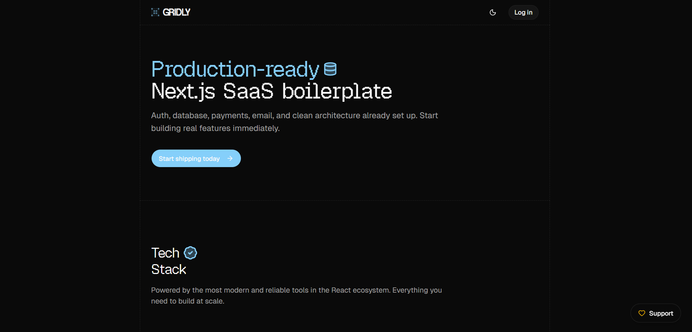

<div align="center">

# Gridly

### The open-source, AI-native Next.js SaaS starter.

Auth, database, payments, AI chat, background jobs — fully wired.<br/>
**Clone it. Configure it. Ship it.**


[Live Demo](https://gridly.akoder.xyz) · [Quick Start](#quick-start) · [Buy Me a Coffee](https://buymeacoffee.com/adikodez)



</div>

---

## What You Get

> One repo. Everything wired. Change `config.ts` and you have a different app.

| Feature | What's Inside |
|---|---|
| **Auth** | Better Auth — GitHub, Google, Discord OAuth, sessions, protected routes |
| **Payments** | Polar — one-time & subscriptions, webhooks, customer portal |
| **AI Chat** | Vercel AI SDK — streaming, tool calling, multi-step agents |
| **Database** | Prisma + PostgreSQL (Neon-ready), typed queries |
| **API** | tRPC — end-to-end type safety, no REST boilerplate |
| **UI** | Shadcn/ui — accessible, themeable component system |
| **UX** | Next.js App Router streaming + layout-matching loading skeletons |
| **Landing Page** | Hero, Features, Pricing, Comparison, FAQ, Footer — all config-driven |
| **Legal** | `/privacy` + `/terms` — editable from config |
| **Config-Driven** | One `config.ts` to rename, reprice, retheme, and rebrand everything |

---

## Quick Start

```bash
# 1. Clone
git clone https://github.com/AdityaKodez/gridly.git my-app
cd my-app
npm install

# 2. Environment
cp .env.example .env
# Fill in your keys (see Environment Variables below)

# 3. Database
npx prisma migrate dev

# 4. Run
npm run dev
```

Open [localhost:3000](http://localhost:3000) — you're live.

---

## One Config, Whole App

Everything that changes between projects lives in one file — `config.ts`:

```ts
export const appConfig = {
  name: "Your App",            // app name everywhere
  description: "Your tagline",
  url: "https://yourapp.com",
  theme: "blue",               // "orange" | "blue" | "violet" | "rose" | "emerald" | "amber"
  radius: "lg",                // "sm" | "md" | "lg" | "xl"
};
```

Landing page copy, pricing plans, auth providers, dashboard nav, legal pages — all driven from this file. No hunting through 20 files to rebrand.

---

## Environment Variables

| Variable | Required | Where to Get It |
|---|---|---|
| `DATABASE_URL` | Yes | Any PostgreSQL — [Neon](https://neon.tech) free tier works great |
| `GOOGLE_GENERATIVE_AI_API_KEY` | Yes | [Google AI Studio](https://aistudio.google.com) |
| `BETTER_AUTH_SECRET` | Yes | Run `openssl rand -base64 32` |
| `BETTER_AUTH_URL` | Yes | Your app URL (`http://localhost:3000`) |
| `GITHUB_CLIENT_ID/SECRET` | OAuth | [GitHub Developer Settings](https://github.com/settings/developers) |
| `GOOGLE_CLIENT_ID/SECRET` | OAuth | [Google Cloud Console](https://console.cloud.google.com) |
| `DISCORD_CLIENT_ID/SECRET` | OAuth | [Discord Developer Portal](https://discord.com/developers) |
| `POLAR_ACCESS_TOKEN` | Payments | [Polar](https://polar.sh) → Settings → API Keys |
| `POLAR_WEBHOOK_SECRET` | Payments | Polar webhook settings |

Only enable the OAuth providers you add keys for — the sign-in page adapts automatically.

---

## Payments Setup (Polar)

1. Create a product at [polar.sh](https://polar.sh)
2. Copy the **Product ID** into `config.ts` → `plansConfig[n].productId`
3. Add `POLAR_ACCESS_TOKEN` + `POLAR_WEBHOOK_SECRET` to `.env`
4. Point webhook to `https://yourdomain.com/api/auth/polar/webhooks`

---

## Adding AI Tools

Extend the AI assistant with your own tools in `app/api/ai/chat/route.ts`:

```ts
tools: {
  getProjectStats: tool({
    description: "Get stats for the current user's projects",
    inputSchema: z.object({}),
    execute: async () => {
      return { totalProjects: 12, activeUsers: 48 };
    },
  }),
}
```

The model calls tools automatically when relevant. Return plain JSON only.

---

## Project Structure

```text
app/
├── (dashboard)/        # Protected app pages (dashboard, settings, AI chat)
├── (marketing)/        # Public landing page
└── api/                # API routes (AI, auth, tRPC)
features/               # Feature modules (ai, auth, dashboard, landing)
lib/                    # Server utilities (auth, db, ai, billing)
trpc/                   # tRPC routers + init
prisma/                 # Schema + migrations
config.ts               # Single config for the entire app
types/                  # Shared TypeScript types
```

---

## Deploy

[](https://vercel.com/new)

For a complete, step-by-step walkthrough of deploying Gridly to Vercel with a Neon Postgres database and all API keys, **👉 [read the Deployment Guide](DEPLOYMENT.md)**.

---

## Tech Stack

| Tech | Purpose |
|---|---|
| [Next.js 16](https://nextjs.org) | App Router, Server Components, Server Actions |
| [TypeScript](https://www.typescriptlang.org) | Strict mode, end-to-end type safety |
| [tRPC](https://trpc.io) | Type-safe API, zero codegen |
| [Prisma](https://www.prisma.io) | Database ORM with migrations |
| [Better Auth](https://better-auth.com) | OAuth, sessions, protected routes |
| [Polar](https://polar.sh) | Payments, subscriptions, webhooks |
| [Vercel AI SDK](https://sdk.vercel.ai) | Streaming AI, tool calling |
| [Shadcn/ui](https://ui.shadcn.com) | Accessible, customizable components |

---

## Support

If Gridly saved you time, consider buying me a coffee.

[](https://buymeacoffee.com/adikodez)

---

## License

MIT — free to use, modify, and ship. See [LICENSE](LICENSE).

---

<div align="center">

Made by [Aditya](https://akoder.xyz)

**Star this repo if it helped you.**

</div>
